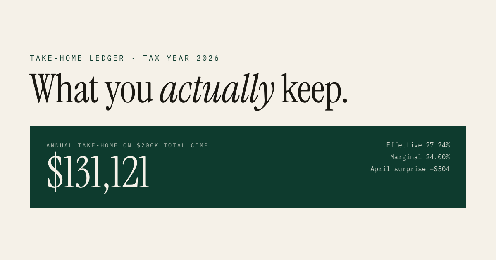
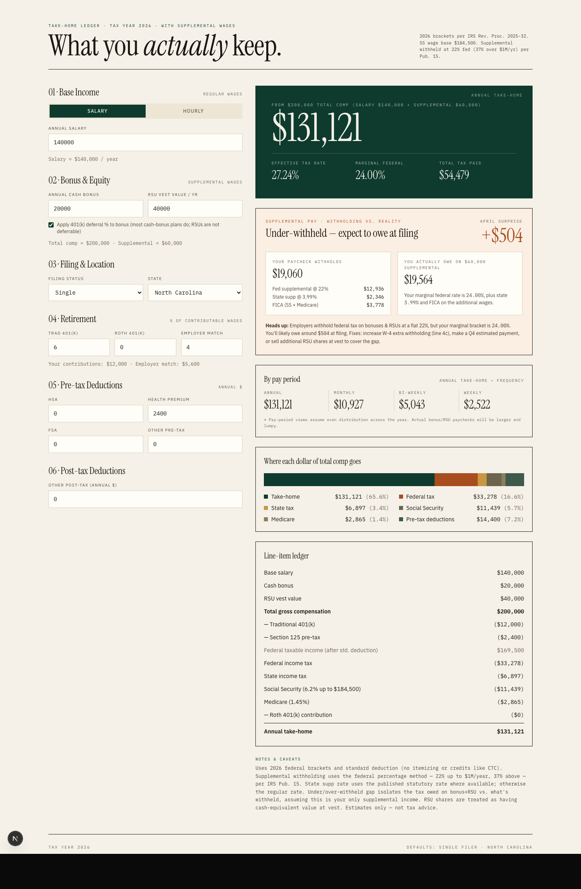

<div align="center">

# Take-Home Calculator · Tax Year 2026

**What you actually keep from salary, bonuses, and RSUs.**

[**Live demo →**](https://take-home-calculator-nine.vercel.app/)

[](./LICENSE)
[](https://nextjs.org)
[](./tsconfig.json)
[](./src/lib/tax.test.ts)



</div>

---

## Why this exists

Generic take-home calculators quietly mislead you about **supplemental-wage
withholding**. Your employer withholds a flat 22% federal tax on bonuses and
RSUs, regardless of your actual bracket. If your marginal rate is 24%+, you're
under-withheld and will owe at filing; if you're in the 12% bracket, you're
over-withheld and can expect a refund.

Most tools hide this. This one makes the **"April surprise"** the hero of the
page — alongside the standard federal / state / FICA breakdown.

> Estimates only. Not tax advice.

## What it does

- **Isolates the April surprise.** A dedicated card shows the delta between
  paycheck supplemental withholding (flat 22% / 37%) and your *actual*
  incremental tax on bonuses + RSUs — so you know whether you'll owe or get a
  refund, with fixes suggested.
- **Side-by-side compare mode.** Toggle on to run two scenarios at once —
  "current job vs offer", "NC vs TX", "single vs MFJ" — with a full A / B / Δ
  breakdown across take-home, effective rate, marginal rate, and tax.
- **Federal bracket breakdown.** Visual stack showing how many of your dollars
  land in each bracket. Makes the difference between marginal and effective
  rates immediately readable.
- **Shareable URL state.** Every input serializes to the URL. Copy the link
  and your spouse, advisor, or future self lands on the exact scenario.
- **Accurate tax semantics.** Traditional 401(k) reduces federal taxable wages
  but *not* FICA wages. HSA / health / FSA (Section 125) reduce both. Social
  Security caps at the $184,500 wage base. 0.9% additional Medicare kicks in
  past the per-filing-status threshold. None of this is glossed over.
- **State income tax** for ~15 common flat-rate states, with a custom-rate
  escape hatch. Progressive-bracket infrastructure is in place for CA/NY
  (data pending verification).

<details>
<summary><strong>Full interface preview</strong></summary>

<br>



</details>

## Stack

- **Next.js 16** · App Router · React 19
- **TypeScript** (strict)
- **Tailwind CSS v4**
- **Vitest** + React Testing Library + jsdom

Calculation logic lives in [`src/lib/tax.ts`](src/lib/tax.ts) as a pure,
side-effect-free module — testable in isolation, reusable outside the UI.

## Getting started

```bash
npm install
npm run dev
```

Open [http://localhost:3000](http://localhost:3000).

## Scripts

| Command               | What it does                        |
| --------------------- | ----------------------------------- |
| `npm run dev`         | Start the Next.js dev server        |
| `npm run build`       | Production build                    |
| `npm run start`       | Run the production build            |
| `npm run lint`        | ESLint (Next.js config)             |
| `npm run typecheck`   | `tsc --noEmit`                      |
| `npm test`            | Run the Vitest suite once           |
| `npm run test:watch`  | Vitest in watch mode                |

## Project structure

```
src/
├── app/
│   ├── layout.tsx                     # Root layout + OG metadata
│   ├── page.tsx                       # Renders <TakeHomeCalculator />
│   └── icon.svg                       # Branded favicon
├── components/
│   ├── TakeHomeCalculator.tsx         # Top-level client component
│   ├── TakeHomeCalculator.test.tsx
│   ├── ScenarioInputs.tsx             # Input form (reused by A + B)
│   └── ScenarioDetail.tsx             # Supp analysis · pay period ·
│                                      # visual breakdown · bracket
│                                      # breakdown · ledger
└── lib/
    ├── tax.ts                         # 2026 tax constants + logic
    ├── tax.test.ts
    ├── format.ts                      # USD / percent / signed formatters
    ├── format.test.ts
    ├── urlState.ts                    # URL ↔ state serialization
    └── urlState.test.ts               # + compare-mode support
```

## What the tests cover

68 tests across 4 files, sub-second runtime. Focused on the parts most likely
to be wrong:

- **Bracket math** — zero / negative income, exact bracket tops, straddling
  boundaries, full top-of-chart walkthrough at $700k.
- **Bracket breakdown** — segment sum equals total tax, segment amounts sum
  to taxable income, top-bracket segment correctly partial.
- **Marginal-rate lookup** — parameterized across every bracket boundary.
- **FICA** — Social Security wage-base cap, uncapped Medicare, the 0.9%
  additional-Medicare surcharge, MFJ-vs-single threshold difference.
- **Pre-tax deduction semantics** — traditional 401(k) reduces federal
  taxable wages but *not* FICA; Section 125 reduces both.
- **Accounting identity** — `takeHome + totalTax + preTax + postTax ==
  totalGross`.
- **Input clamping** — negative salary / bonus / RSU values treated as 0.
- **Supplemental wages** — over-withholding (refund), under-withholding
  (bill), the $1M / 37% cap, `defer401kFromBonus` correctly reducing the
  withholding base without touching FICA.
- **State handling** — zero-tax states, flat-rate states with standard
  deductions, custom-rate (`other`), progressive brackets, and states where
  the supp rate ≠ regular rate (IN).
- **URL state** — serialize ↔ parse round-trip for every field, compare-mode
  `b_` prefix, invalid params dropped silently rather than crashing.
- **Component smoke test** — default render, take-home computed correctly,
  updates reactively when inputs change.

Run `npm test` to execute the full suite.

## 2026 tax data sources

- Federal brackets & standard deduction — IRS Rev. Proc. 2025-32
- Social Security wage base — SSA 2026 fact sheet ($184,500)
- Medicare + additional Medicare — IRS Pub. 15
- Supplemental wage percentage method — IRS Pub. 15 (22% up to $1M, 37% above)
- State rates — respective state revenue department publications

## License

[MIT](./LICENSE)
